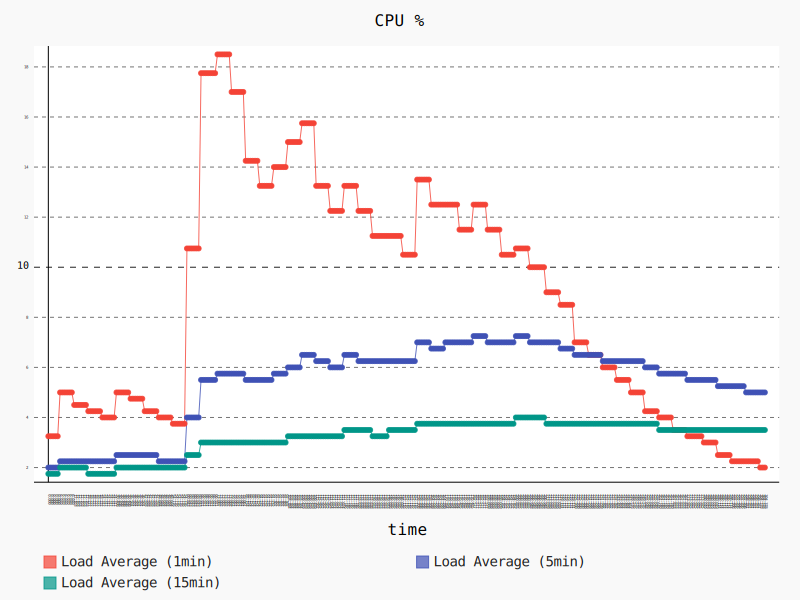
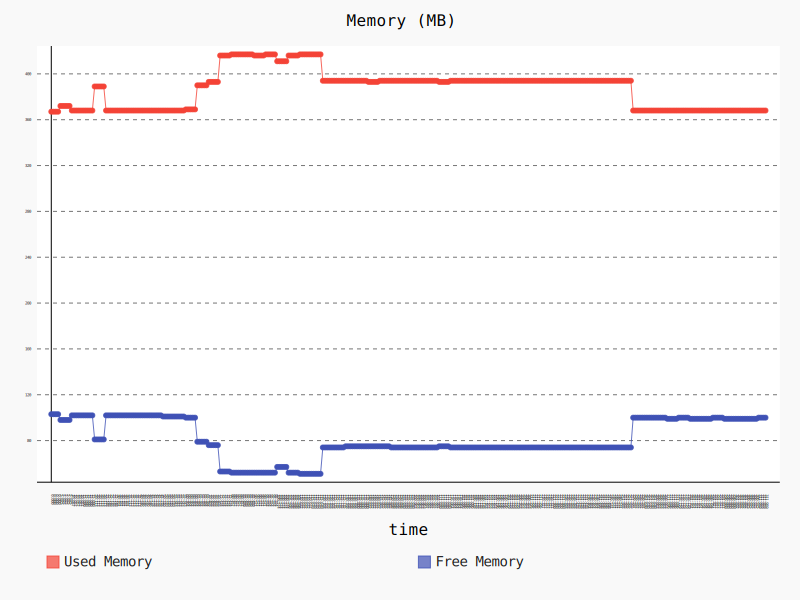

# cloudwatch_metrics_collector


## Overview
The `cloudwatch_metrics_collector` ROS Node publishes your robot's metrics to the cloud to enable you to easily track the health of a fleet with the use of automated monitoring and actions for when a robot's metrics show abnormalities. You can easily track historic trends and profile behavior such as resource usage. Out of the box it provides a ROS interface to take a ROS message defining a metric and publish it to Amazon CloudWatch Metrics. The only configuration required to get started is setting up AWS Credentials and Permissions for your robot.The CloudWatch Metrics Node can be used with existing ROS Nodes that publish metric messages or with your own nodes if you instrument them to publish your own custom metrics.

**Amazon CloudWatch Metrics Summary**: Amazon CloudWatch is a monitoring and management service built for developers, system operators, site reliability engineers (SRE), and IT managers. CloudWatch provides you with data and actionable insights to monitor your applications, understand and respond to system-wide performance changes, optimize resource utilization, and get a unified view of operational health. CloudWatch collects monitoring and operational data in the form of logs, metrics, and events, providing you with a unified view of AWS resources, applications and services that run on AWS, and on-premises servers. You can use CloudWatch to set high resolution alarms, visualize logs and metrics side by side, take automated actions, troubleshoot issues, and discover insights to optimize your applications, and ensure they are running smoothly.

**Keywords**: ROS, AWS, CloudWatch, Metrics

### License
The source code is released under an [Apache 2.0].

**Author**: AWS RoboMaker<br/>
**Affiliation**: [Amazon Web Services (AWS)]<br/>
**Maintainer**: AWS RoboMaker, ros-contributions@amazon.com

### Supported ROS Distributions
- Kinetic
- Melodic

### Build status

* Travis CI: [](https://travis-ci.org/aws-robotics/cloudwatchmetrics-ros1)
 * ROS build farm:
   * v1.0.0:
     * ROS Kinetic @ u16.04 Xenial [](http://build.ros.org/job/Kbin_uX64__cloudwatch_metrics_collector__ubuntu_xenial_amd64__binary)

## Installation

### AWS Credentials
You will need to create an AWS Account and configure the credentials to be able to communicate with AWS services. You may find [AWS Configuration and Credential Files] helpful. Specifying AWS [credentials by setting environment variables](https://docs.aws.amazon.com/cli/latest/userguide/cli-environment.html) is not supported.

This node will require the following AWS account IAM role permissions:
- `cloudwatch:PutMetricData`

### Binaries
On Ubuntu you can install the latest version of this package using the following command

        sudo apt-get update
        sudo apt-get install -y ros-kinetic-cloudwatch-metrics-collector

### Building from Source

To build from source you'll need to create a new workspace, clone and checkout the latest release branch of this repository, install all the dependencies, and compile. If you need the latest development features you can clone from the `master` branch instead of the latest release branch. While we guarantee the release branches are stable, __the `master` should be considered to have an unstable build__ due to ongoing development. 

- Create a ROS workspace and a source directory

    mkdir -p ~/ros-workspace/src

- Clone the package into the source directory . 

_Note: Replace __`{MAJOR.VERSION}`__ below with the latest major version number to get the latest release branch._

        cd ~/ros-workspace/src
        git clone https://github.com/aws-robotics/cloudwatchmetrics-ros1.git -b release-v{MAJOR.VERSION}

- Install dependencies

        cd ~/ros-workspace 
        sudo apt-get update && rosdep update
        rosdep install --from-paths src --ignore-src -r -y
        
_Note: If building the master branch instead of a release branch you may need to also checkout and build the master branches of the packages this package depends on._

- Build the packages

        cd ~/ros-workspace && colcon build

- Configure ROS library Path

        source ~/ros-workspace/install/setup.bash

- Build and run the unit tests

        colcon build --packages-select cloudwatch_metrics_collector --cmake-target tests
        colcon test --packages-select cloudwatch_metrics_collector cloudwatch_metrics_common && colcon test-result --all


## Launch Files
In order to include a `cloudwatch_metrics_collector` in your launch file, you should add `<include file="$(find cloudwatch_metrics_collector)/launch/cloudwatch_metrics_collector.launch" />` to your launch file. The launch file uses the following arguments:

| Arg Name | Description |
| --------- | ------------ |
| node_name | (optional) The name the metrics node should be launched with. If not provided the node will default to "cloudwatch_metrics_collector" |
| config_file | (optional) A path to a posparam config file. If provided the launch file will use rosparam to load the configuration into the private namespace of the node. |

An example launch file called `sample_application.launch` is included in this project that gives an example of how you can include this node in your project and provide it with arguments.


## Usage

### Run the node
- **With** launch file using parameters in .yaml format (example provided)
  - ROS: `roslaunch cloudwatch_metrics_collector sample_application.launch --screen` 

### Send a test metric 
- `rostopic pub /metrics ros_monitoring_msgs/MetricList '[{header: auto, metric_name: "ExampleMetric", unit: "sec", value: 42, time_stamp: now, dimensions: []}, {header: auto, metric_name: "ExampleMetric2", unit: "count", value: 22, time_stamp: now, dimensions: [{name: "ExampleDimension", value: "1"}]}]'`


## Configuration File and Parameters
An example configuration file named `sample_configuration.yaml` is provided that contains a detailed example configuration for the Node.

All parameters to the Node are provided via the parameter server when the node is started. When loading configuration the Node will start looking for each setting inside of its private namespace and then search up the namespace heirarchy to the global namespace for the parameters.

| Parameter Name | Description | Type |
| ------------- | -----------------------------------------------------------| ------------- |
| aws_metrics_namespace | (optional) If provided it will set the namespace for all metrics provided by this node to the provided value. If the node is running on AWS RoboMaker then the provided launch file will ignore this parameter in favor of the namespace specified by the AWS RoboMaker ecosystem | *string* |
| aws_monitored_metric_topics | (optional) An optional list of topics to listen to. If not provided or is empty the node will just listen on the global "metrics" topic. If this list is not empty then the node will not subscribe to the "metrics" topic and will only subscribe to the topics in the list. | *array of strings* |
| aws_client_configuration | (optional) If given the node will load the provided configuration when initializing the client. If a specific configuration setting is not included in the map then it will search up the namespace hierarchy for an 'aws_client_configuration' map that contains the field. In this way, a global configuration can be provided for all AWS nodes with only specific values overridden for a specific Node instance if needed | *map* |
| storage_resolution | (optional) The storage resolution level for presenting metrics in CloudWatch. For more information, see [high-resolution-metrics]. | *int* |


## Performance and Benchmark Results
We evaluated the performance of this node by runnning the followning scenario on a Raspberry Pi 3 Model B:
- Launch a baseline graph containing the talker and listener nodes from the [roscpp_tutorials package](https://wiki.ros.org/roscpp_tutorials), plus two additional nodes that collect CPU and memory usage statistics. Allow the nodes to run for 60 seconds. 
- Launch the CloudWatch Metrics node using the launch file `sample_application.launch` as described above. At the same time, send messages to the to the `/metrics` topic by running the following script in the background: 

```bash
function metric { 
  echo "{header: auto, metric_name: 'ExampleMetric', unit: 'sec', value: "${i}", time_stamp: now, dimensions: []}"; 
}

for i in {1..10}
do 
  rostopic pub -1 /metrics ros_monitoring_msgs/MetricList "[$(metric $i)]"
done 
```

- Allow the nodes to run for 180 seconds. 
- Terminate the CloudWatch Metrics node, and allow the remaining nodes to run for 60 seconds. 

The graph below shows the CPU usage during that scenario. We can see how the 1 minute average CPU usage increases when we launch the `cloudwatch_metrics_collector` node around second 60, and the node starts processing messagess, with a peak of 18.5% showing an increase of 15.25% with respect to the initial usage of 3.25%. After we stop sending messages to the `cloudwatch_metrics_collector` node around second 120, the 1 minute average CPU usage decreases to around 12.5, and then goes down to around the initial value as the node finishes sending the metrics to Amazon CloudWatch. The CPU usage goes back to around the original value when we stop the node at the end of the scenario. 



The graph below shows the memory usage during that scenario. We start with a memory usage of 368 MB that increases to 417 MB (+13.3%) when the `cloudwatch_metrics_collector` node starts running, and decreases to 394 MB (+7% wrt. initial value) when the node is not processing messages. The memory usage goes back to 368 MB after stopping the node. 




## Node

### cloudwatch_metrics_collector
Sends metrics in a ROS system to AWS CloudWatch Metrics service.

#### Subscribed Topics
- **`Configurable (default="/metrics")`**

  The node can subscribe to a configurable list of topic names. If no list in provided then it will default to subscribing to a global topic names `/metrics`.<br/>
  Message Type: `ros_monitoring_msgs/MetricList`

#### Published Topics
None

#### Services
None


## Bugs & Feature Requests
Please contact the team directly if you would like to request a feature.

Please report bugs in [Issue Tracker].


[Amazon Web Services (AWS)]: https://aws.amazon.com/
[Apache 2.0]: https://aws.amazon.com/apache-2-0/
[AWS Configuration and Credential Files]: https://docs.aws.amazon.com/cli/latest/userguide/cli-config-files.html
[high-resolution-metrics]: https://docs.aws.amazon.com/AmazonCloudWatch/latest/monitoring/publishingMetrics.html#high-resolution-metrics
[Issue Tracker]: https://github.com/aws-robotics/cloudwatchmetrics-ros1/issues
[ROS]: http://www.ros.org
